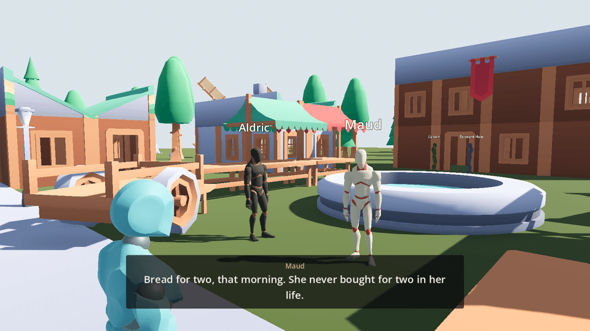
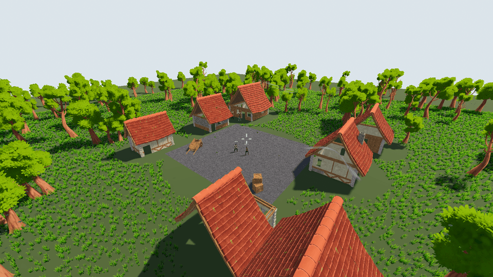

# Godot NPC Village



A small medieval village in Godot 4.8 where the villagers hold conversations with each
other that nobody wrote. The Claude API writes their dialogue while the game runs, and
ElevenLabs speaks it aloud in a different voice for each villager.

The village is Ashmoor: a market square with a fountain, a smithy, a bakery, a tavern
called the Crooked Hart, a chapel, a watermill and a windmill. Six villagers stand in
three groups around it. The lord's tax collector is expected before the harvest, and the
miller's youngest daughter has not been seen for six days. None of the villagers have
scripted lines about any of that. They have personalities, opinions about each other, and
things they each know and are not saying, and they work the rest out between them every
time you walk up.

## What actually happens when you walk into the square

1. An `Area3D` around the group notices the player and tells the `ConversationGroup`.
2. The group asks `ConversationDirector` for a *beat*: three to six turns of dialogue.
3. The director sends one request to the Claude API carrying the village's situation and
   the full personality of everyone standing there, and gets the whole beat back as
   schema-validated JSON.
4. Each turn goes to an `NPC`, which asks `VoiceService` for the audio, plays it from an
   `AudioStreamPlayer3D`, and shows the line on the subtitle HUD.
5. Two turns before the beat runs out, the group quietly requests the next one, so the
   conversation continues without a pause.

Walk away and the conversation trails off. Walk back and they are talking about something
else, because the situation they were given has changed.



## Running it

The project needs two API keys. Both are read from `.env` in any parent directory of the
project, from the process environment, or from `user://secrets.cfg`. Nothing is committed
and nothing is written back.

```
ANTHROPIC_API_KEY=sk-ant-...
ELEVEN_LABS_API_KEY=sk_...
```

Then pull the addons, which are not committed here, and open the project.

```
python tools/pull_addons.py
```

The game runs without either key. With no Anthropic key the villagers fall back to the
authored lines on each group; with no ElevenLabs key they mime and you read the subtitles.
Any line already in the voice cache still plays either way.

## Talking to them

Hold **T**, say something, and let go. The microphone opens while the key is down, the
recording goes to ElevenLabs' `scribe_v1` for transcription, and whichever villager you
are standing nearest within five yards answers first. The others in that group join in
only if they have something of their own to add, which is the dialogue model's judgement
rather than a rule in the code: the prompt tells it that a villager with nothing to say
should stay out of it.

Your line joins the transcript like any other turn, so they remember it and can refer
back to it later in the conversation. Measured round trip from releasing the key to a
villager speaking is about six seconds.

Asked "Aldric, who was the rider you shod a horse for?", the blacksmith answered "He gave
no name and I didn't ask for one. He paid, and his coin was older than me." Nobody wrote
that line; it came from the two facts his persona holds about the rider.

The subtitle bar shows what was heard before the reply arrives, which matters because a
transcription can be wrong and the player needs to see that it was.

## The voice bank

`assets/voice/` holds spoken lines as ordinary mp3 files, committed to the repository
alongside a `manifest.json` saying what each one says, who says it, in which voice, and
how long it runs. Each file is named by the same hash `VoiceService` looks a line up
by, so the bank is a drop-in for the runtime cache.

`VoiceService` looks in four places, in order: the committed bank, the writable cache in
`user://`, the remote bank, then the API. The first three need no key and no quota, and
the bank is checked before the service even asks whether it is available, so a keyless
build, an offline session and a test run all still hear every line that has been baked.

The remote step is what makes a web build work. The clips are plain files in git, so
raw.githubusercontent.com serves them directly: the export can leave the audio out of the
`.pck` and stay small, and the page downloads each clip the first time it is needed and
keeps it in browser storage. Point `VoiceService.remote_bank_base_url` at the branch you
publish. Only the manifest has to ship in the build, and it is a few kilobytes.

Build the bank with:

```
/Applications/Godot.app/Contents/MacOS/Godot --headless --path . -s tools/bake_voice_bank.gd
    ... -- --dry-run        report what it would do, synthesize nothing
    ... -- --promote-only   copy from the cache, never call out
```

It promotes anything the runtime cache has recorded the text of, synthesizes the authored
fallback lines from `resources/fallback_lines.json` if they are missing, and adopts any
clip already sitting in the bank rather than paying for it twice. Re-running it when
nothing has changed costs nothing.

## Cost, and why the village is quiet until you arrive

Both services are metered, and this was the single most important thing to get right.

A beat costs roughly one cent of Claude tokens and about 330 characters of ElevenLabs
quota. A free ElevenLabs account allows 10,000 characters a month in total, which is about
thirty conversations. During development, three groups left chattering to an empty square
spent 12.6% of the month's voice quota in one idle run that nobody was present to hear.

So `ConversationGroup.converse_only_when_player_present` defaults to on. The village is
silent until you walk into it, and the entire budget goes on conversations that actually
reach the player. `VoiceService.session_character_ceiling` is a second guard, defaulting to
900 characters per session, and the service reads the account's real remaining quota at
startup and lowers itself to fit.

Three things keep the cost down beyond that:

- **The voice cache.** Every clip is keyed by the hash of the text, the voice and the
  synthesis settings, and kept under `user://voice_cache/`. A line that has been said
  before costs nothing and needs no key, no quota and no network.
- **Prompt caching.** The village lore, the direction and the personas are one stable
  prefix with the cache breakpoint on the last block, so a second request for the same
  group reads 1,453 tokens from cache instead of being billed for them. Measured on this
  project: `cache_read_input_tokens` 1453, `input_tokens` 70.
- **Low effort.** Village small talk does not need deep reasoning, and `output_config.effort`
  of `low` is what keeps a beat inside the six or seven seconds that prefetching can hide.

### ElevenLabs free tier

Two limits are worth knowing before wondering why a villager is silent. Free accounts
cannot use *library* voices through the API and get HTTP 402 `paid_plan_required`; only the
21 *premade* voices work. Every villager in this project is therefore cast from premade
voices, and `test_npc_persona.gd` fails the build if anyone is given a blocked one.

## Tests

The suite is 74 tests and runs entirely from recorded fixtures and committed clips. It never makes a network
request, so it costs nothing and works in CI with no credentials. This is enforced rather
than assumed: `RuntimeMode.is_offline()` detects GUT's runner on the command line and both
paid services refuse to send anything when it returns true.

Verified by checking the ElevenLabs quota before and after a full run: 2922 characters
both times, nothing spent. The microphone is never opened in a test either.

```
& 'C:\Godot\godot.exe' --headless --path . -s addons/gut/gut_cmdln.gd -gdir=res://tests/unit,res://tests/integration -gexit
```

On the Mac:

```
/Applications/Godot.app/Contents/MacOS/Godot --headless --path . -s addons/gut/gut_cmdln.gd -gdir=res://tests/unit,res://tests/integration -gexit
```

The fixtures in `tests/fixtures/` are real recordings, not hand-written approximations: a
genuine Claude response, a genuine ElevenLabs clip, and a sample `.env` with the CRLF line
endings the shared file really has.

## Layout

```
scripts/
  conversation/
    conversation_director.gd   Claude API client, autoloaded as ConversationDirector
    conversation_group.gd      Runs one conversation, owns the transcript and pacing
    conversation_turn.gd       One villager saying one thing
    npc_persona.gd             Who a villager is, and how they sound
  npc/
    npc.gd                     A villager: performs a turn, reports when it is done
    speaking_modifier.gd       Poses gestures the animation library has no clip for
  player/
    player_voice.gd            Push to talk, and who it reaches
  services/
    secrets.gd                 Key resolution, autoloaded as Secrets
    voice_service.gd           Speech, the clip bank and the cache, autoloaded
    speech_service.gd          The microphone and transcription, autoloaded
    runtime_mode.gd            Decides whether this process may use the network
  ui/
    subtitle_hud.gd            Screen-space subtitles
tools/
  build_personas.gd            Generates resources/personas/*.tres
  build_world.gd               Generates scenes/villagers/*.tscn and scenes/world.tscn
  build_audio_bus.gd           Generates the microphone bus layout
  bake_voice_bank.gd           Builds assets/voice/ and its manifest
  inventory_assets.py          Surveys an asset library before anything is imported
  tinyify.py                   Downsizes and compresses textures to the 512 limit
  pull_addons.py               Vendors the addons listed in tools/addons.json
```

The scenes in `scenes/` are committed and are what the game loads; nothing is assembled at
run time. They are generated rather than placed by hand because the village is six hundred
modular pieces, and a script makes the layout reproducible. Signal connections are written
into the scene files with `CONNECT_PERSIST` so the wiring lives in the scene rather than in
a `_ready` that rebuilds it every run.

## Design notes

**Beats, not lines.** Asking the model for one line at a time would put a round trip
between every villager speaking. A beat of three to six turns costs one round trip, and
requesting the next beat two turns early hides it entirely.

**Cutting a beat is deliberate.** A beat is a guess about a moment. Once the player arrives
or leaves, the rest of that guess is wrong, so the group drops it and asks again with the
new situation.

**Animation is clips first, procedural second.** The villagers play Quaternius's Universal
Animation Library: `Idle_Loop` when they have nothing to say, `Idle_Talking_Loop` while
they speak, and `Yes` / `Idle_No_Loop` for a nod and a shake of the head.

Not every gesture the dialogue model can ask for has a clip. `shrug`, `lean_in`,
`turn_away`, `point` and `laugh` do not, so those are posed procedurally by
`SpeakingModifier` on the humanoid bones instead. The two never run at once: the NPC
checks whether a real talking clip exists and, if it does, leaves the procedural sway
switched off, because two things driving the same bones fight each other. A rig without a
talking animation falls back to the procedural path and still moves while it speaks.

The procedural half has to be a `SkeletonModifier3D`. The skeleton applies its animation
every frame, and anything writing bone poses before that is simply overwritten.

**One rig, no retargeting.** The fantasy outfits and the animation library are modelled on
the same 65-joint skeleton, so any villager plays any of the 262 clips directly. That is an
assumption about two third-party packs rather than something the engine guarantees, so
`test_villager_rig.gd` asserts it: every outfit must carry every bone the animations drive,
and the clips the code names must exist. If a pack update ever broke it, the villagers
would go still and nothing else would say why.

**Each villager is their own scene.** `scenes/villagers/*.tscn` is generated per persona,
because the body is part of who someone is. An earlier version tinted one grey mannequin
six ways, which told you nothing across a square. Now the priest is in robes and the
serjeant in a gambeson, and you can tell them apart before either has spoken.

**Subtitles are screen-space.** They were first tried as a `Label3D` over each villager's
head, which cannot work: a world-space label is sized in metres, so it is unreadable across
the square and fills the screen up close. The name plate stays in world space, because that
genuinely should shrink with distance.

## Known gaps

- Five of the eight gestures (`shrug`, `lean_in`, `turn_away`, `point`, `laugh`) have no
  clip in the animation library and are posed procedurally. They read acceptably but a real
  clip would be better.
- The village buildings are still the Kenney Fantasy Town Kit. Quaternius's Medieval
  Village MegaKit is in the staging area and is denser and better matched to the villagers;
  swapping it in means re-measuring the module grid in `build_world.gd`.
- The API keys live in the client. That is fine for a local project and wrong for anything
  shipped, where the requests should go through a relay that holds the keys server-side.

## Third-party assets

All assets are CC0 or MIT and are attributed below.

| Asset | Source | License |
| --- | --- | --- |
| Medieval Village MegaKit | <https://quaternius.com> | CC0 1.0 |
| Stylized Nature MegaKit | <https://quaternius.com> | CC0 1.0, via the WeatherFX addon |
| Universal Base Characters | <https://quaternius.com> | CC0 1.0 |
| Modular Character Outfits: Fantasy | <https://quaternius.com> | CC0 1.0 |
| Universal Animation Library 1 and 2 | <https://quaternius.com> | CC0 1.0 |

The Kenney kits are in `assets/kenney/` and the Quaternius packs in `assets/quaternius/`,
each with the `License.txt` from its download.

Only six outfits and the two animation libraries are committed, not the whole packs. The
source textures are 4096 square and run to 180 MB; `tools/tinyify.py` downsizes them to the
512 limit these projects import at, which brings the same 25 textures to about 3 MB with no
visible difference at the size a villager occupies on screen. `tools/inventory_assets.py`
is what picks which packs are worth taking in the first place.

## Addons

The addons are not committed. `python tools/pull_addons.py` vendors them from their own
repositories, as listed in `tools/addons.json`:

- [3d_player_controller](https://github.com/kirbycope/godot-3d-player-controller-addon)
- [controls](https://github.com/kirbycope/godot-controls)
- [weather_fx](https://github.com/kirbycope/weather-fx)
- [date_and_time](https://github.com/kirbycope/date-and-time)

GUT is vendored the same way, pinned to `v9.6.1` in the manifest so the test framework
cannot drift under the suite. It is third-party and never edited here, so it is never
pushed back.

If any of these are edited, run `python tools/push_addons.py -m "..."` before pushing this
project, or the addon half of the work stays on the machine it was made on.
